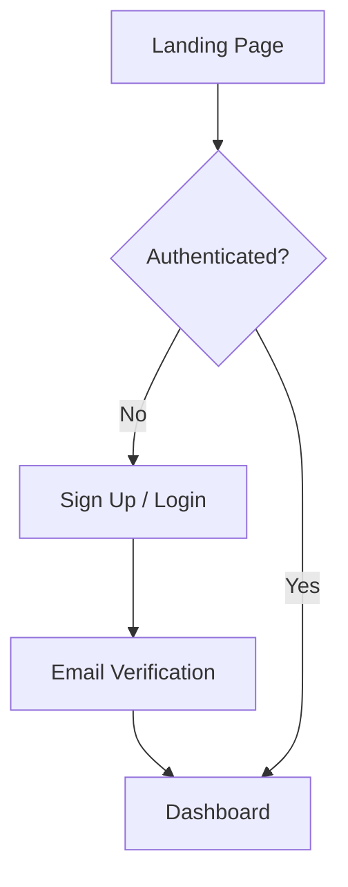
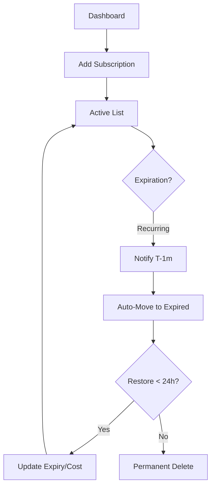

# Subscription Tracker - UI Product Requirements Document (PRD)

**Project**: Real-Time Subscription Tracker  
**Purpose**: Personal finance management for subscription monitoring  
**Tech Stack**: Next.js, React, Supabase, Vercel  
**Target Users**: Individual subscription managers (college students → professionals)

---

## **1. Design Philosophy & Aesthetic Direction**

### **Visual Identity**
**Aesthetic**: Modern, clean, and purposeful with Apple-style minimalism meets fintech sophistication
- **Tone**: Professional yet approachable, trustworthy, modern
- **Key Feeling**: "Clarity over clutter" — users understand their spending instantly
- **Visual Language**: Clean typography, generous whitespace, subtle gradients, smooth animations

### **Design Principles**
1. **Progressive Disclosure**: Show essential info first, detailed info on demand
2. **Real-time Feedback**: Every action has immediate visual feedback
3. **Data Visualization**: Make spending patterns visible at a glance
4. **Accessibility**: High contrast, readable fonts, keyboard navigation
5. **Consistency**: Unified component system across all pages

---

## **2. Color Palette (Premium Edition)**

### **Brand Colors**
```
Meta Blue:          #2563EB (Core action color, trustworthy)
Midnight Slate:     #1E293B (The foundation color for text and dark cards)
Cloud White:        #F8FAFC (Clean background for light mode)
```

### **Semantic Colors**
```
Vibrant Emerald:    #10B981 (Success, active states, restorations)
Amber Warning:      #F59E0B (Urgency, expiring soon alerts)
Crimson Alert:      #EF4444 (Destructive actions, delete, errors)
Muted Silver:       #94A3B8 (Disabled, archived states)
Electric Violet:    #8B5CF6 (Accents, premium features, highlight)
```

### **Surface & Depth (Glassmorphism)**
```
Surface Light:      rgba(255, 255, 255, 0.7) (Glass card background)
Surface Border:     rgba(226, 232, 240, 0.5) (Subtle card border)
Backdrop Blur:      12px (Standard blur for modals and glass surfaces)
```

### **Gradients**
```
Gradient Horizon:   #2563EB → #8B5CF6 (Main dashboard CTA & hero sections)
Gradient Ghost:     rgba(248, 250, 252, 0.8) → rgba(226, 232, 240, 0.4)
```

---

## **3. Typography**

### **Font Stack**
```
Display Font:       "Clash Display" or "Outfit" (Bold headers, large text)
Body Font:          "Inter" or "Segoe UI" (Clean, readable body text)
Code Font:          "Fira Code" or "JetBrains Mono" (Monospace for links, amounts)
```

### **Type Scale**
```
H1 (Hero):          48px, 700 weight, 1.2 line-height
H2 (Page Title):    36px, 600 weight, 1.3 line-height
H3 (Section Head):  24px, 600 weight, 1.4 line-height
H4 (Card Title):    18px, 600 weight, 1.4 line-height
Body Large:         16px, 400 weight, 1.6 line-height
Body Regular:       14px, 400 weight, 1.5 line-height
Body Small:         12px, 400 weight, 1.5 line-height
Label:              12px, 500 weight, 1.4 line-height
Button:             14px, 600 weight, 1.4 line-height
```

---

## **4. Layout & Spacing**

### **Grid System**
- **Base Unit**: 4px (multiples: 4, 8, 12, 16, 20, 24, 32, 40, 48, 56, 64)
- **Container Max-Width**: 1280px
- **Gutters**: 24px (desktop), 16px (tablet), 12px (mobile)

### **Spacing Scale**
```
XS:    4px
SM:    8px
MD:    12px
LG:    16px
XL:    24px
2XL:   32px
3XL:   40px
4XL:   48px
```

### **Breakpoints**
```
Mobile:     < 640px
Tablet:     640px - 1024px
Desktop:    > 1024px
```

---

## **5. Component Library**

### **5.1 Buttons**

#### **Primary Button**
- Background: Gradient #2563EB → #8B5CF6
- Text: White, 14px, 600 weight
- Padding: 12px 24px
- Border Radius: 8px
- Hover: Opacity 0.9, shadow elevation
- Active: Scale 0.98
- Disabled: Opacity 0.5, cursor not-allowed
- **Used for**: Main CTAs (Add Subscription, Save, Restore)

#### **Secondary Button**
- Background: #E2E8F0
- Text: #1E293B, 14px, 600 weight
- Padding: 12px 24px
- Border Radius: 8px
- Hover: Background #CBD5E1
- **Used for**: Cancel, back actions

#### **Tertiary Button**
- Background: Transparent
- Text: #2563EB, 14px, 600 weight
- Border: 1px solid #2563EB
- Padding: 12px 24px
- Border Radius: 8px
- Hover: Background #F0F4FF
- **Used for**: Alternative actions

#### **Danger Button**
- Background: #EF4444
- Text: White, 14px, 600 weight
- Padding: 12px 24px
- Border Radius: 8px
- Hover: Opacity 0.9
- **Used for**: Delete actions

#### **Icon Button**
- Background: Transparent
- Icon: 24px, #1E293B
- Padding: 8px
- Border Radius: 6px
- Hover: Background #F1F5F9
- **Used for**: Menu triggers, close buttons

### **5.2 Cards**

#### **Subscription Card (Active)**
- **Background**: Glassmorph Surface (Surface Light)
- **Border**: 1px solid Surface Border
- **Backdrop-filter**: blur(8px)
- **Border Radius**: 16px
- **Padding**: 24px
- **Shadow**: 0 4px 6px -1px rgba(0, 0, 0, 0.1), 0 2px 4px -1px rgba(0, 0, 0, 0.06)
- **Hover**: 
  - Shadow: 0 10px 15px -3px rgba(0, 0, 0, 0.1), 0 4px 6px -2px rgba(0, 0, 0, 0.05)
  - Border: 1px solid #2563EB
  - Scale: 1.01
- **Transition**: all 0.3s cubic-bezier(0.4, 0, 0.2, 1)
- Layout:
  ```
  ┌─────────────────────────────────┐
  │ [Icon] Netflix          [⋯ Menu]│
  │ Expires: Apr 10, 2026           │
  │ $12.99 / month                  │
  │ www.netflix.com (clickable link)│
  └─────────────────────────────────┘
  ```

#### **Subscription Card (Disabled)**
- Background: #FFFFFF
- Opacity: 0.6
- Text Color: #64748B (muted)
- Text Decoration: Strikethrough (optional)
- Border: 1px dashed #CBD5E1
- Hover Shadow: Reduced
- Visual Indicator: "DISABLED" badge in corner
- Same layout as active but grayed out

#### **Expired Subscription Card**
- Background: #FEF3C7 (soft yellow background)
- Border: 2px solid #F59E0B
- Badge: "Expired" in orange
- Extra Info: "Expired on [date]" in small text
- Layout:
  ```
  ┌─────────────────────────────────┐
  │ [Icon] Spotify         [⋯ Menu] │
  │ 🏷️ Expired              [Restore]│
  │ Expired: Apr 5, 2026            │
  │ $9.99 / month                   │
  │ Can restore until: Apr 12, 2026 │
  └─────────────────────────────────┘
  ```

#### **Deleted Subscription Card**
- Background: #F3F4F6
- Opacity: 0.5
- Border: 1px dashed #9CA3AF
- Badge: "Deleted" in gray
- Layout similar to expired

### **5.3 Input Fields**

#### **Text Input**
- Background: #F8FAFC
- Border: 1px solid #E2E8F0
- Border Radius: 8px
- Padding: 12px 16px
- Font: 14px, #1E293B
- Focus: Border #2563EB, box-shadow: 0 0 0 3px rgba(37,99,235,0.1)
- **States**: Default, Focus, Disabled, Error

#### **Date Input**
- Custom date picker UI (not browser default)
- Calendar popup on click
- Show selected date in format: "Apr 10, 2026"
- Clear button (X icon) to reset

#### **Time Input**
- 24-hour format (HH:MM)
- Spinners or manual input
- Show as "05:30 PM" in UI

#### **Number Input (Cost)**
- Right-aligned numbers
- Currency symbol (₹, $, €) prefix
- Allows decimal (.99)
- Clear button to reset

#### **Select/Dropdown**
- Background: #F8FAFC
- Border: 1px solid #E2E8F0
- Border Radius: 8px
- Padding: 12px 16px
- **Options panel**: Smooth slide-down animation, shadow
- Active option: Background #F0F4FF, text #2563EB

#### **Link Input**
- Background: #F8FAFC
- Border: 1px solid #E2E8F0
- Padding: 12px 16px
- Show globe icon on left
- Show "Open link" icon on right
- Validate URL format on blur

### **5.4 Modals & Dialogs**

#### **Add/Edit Subscription Modal**
- **Backdrop**: Semi-transparent black (rgba(0,0,0,0.5))
- **Modal Size**: 500px max-width (responsive on mobile)
- **Border Radius**: 12px
- **Padding**: 32px (header), 24px (body), 24px (footer)
- **Header**: 
  - Title: "Add Subscription" or "Edit Subscription" (H3)
  - Close button (X) top-right
- **Body**:
  - Form fields stacked vertically
  - Field spacing: 20px between fields
  - Help text under each field (optional)
- **Footer**:
  - Cancel button (Secondary)
  - Submit button (Primary)
- **Animation**: Fade in 200ms, scale up slightly (0.95 → 1)

#### **Confirmation Dialog**
- **Size**: 400px max-width
- **Content**:
  - Icon (warning/delete icon)
  - Title: "Delete [Subscription Name]?"
  - Description: "This action cannot be undone."
  - Two buttons: Cancel (Secondary), Delete (Danger)
- **Animation**: Same as modal

#### **Toast/Notification**
- **Position**: Bottom-right corner, 16px from edges
- **Size**: Auto width, max 400px
- **Padding**: 16px
- **Border Radius**: 8px
- **Variants**:
  - **Success**: Green (#10B981) background, white text, checkmark icon
  - **Error**: Red (#EF4444) background, white text, X icon
  - **Warning**: Orange (#F59E0B) background, dark text, warning icon
  - **Info**: Blue (#2563EB) background, white text, info icon
- **Duration**: Auto-dismiss after 5 seconds (or manual close)
- **Animation**: Slide up 300ms, fade out 300ms on dismiss
- **Z-index**: Always on top

#### **Persistent Toast (T-1 Minute Warning)**
- **Position**: Bottom-right corner
- **Background**: #FEF3C7 (soft yellow)
- **Border**: 2px solid #F59E0B (orange)
- **Text**: "Your [Subscription Name] expires in less than 1 minute!" (16px, bold)
- **Icon**: Clock/warning icon
- **Duration**: Stays visible for exactly 1 minute
- **Close button**: X icon (manual dismiss)
- **Animation**: Slide up 300ms on appear
- **Z-index**: Higher than regular toasts

### **5.5 Badges & Tags**

#### **Status Badge**
```
Active:      Green (#10B981), rounded-full
Disabled:    Gray (#94A3B8), rounded-full
Expired:     Orange (#F59E0B), rounded-full
Deleted:     Gray (#9CA3B8), rounded-full
```
- **Style**: Background + dark text
- **Size**: Small (12px font)
- **Padding**: 4px 12px
- **Border Radius**: 20px (pill shape)

#### **Time Alert Badge**
```
Text:        "Expires in < 1 minute"
Background:  #FEF3C7 (soft yellow)
Text Color:  #92400E (dark brown)
Icon:        ⏰ Clock
```

### **5.6 Typography Elements**

#### **Empty State**
```
Icon:        Large (64px), light gray (#CBD5E1)
Title:       "Add a new subscription to get started"
Subtitle:    "Track and manage all your subscriptions in one place"
CTA Button:  Primary button
```

#### **Section Header**
```
Title:       H2 or H3 (36px or 24px)
Subtitle:    Body Regular, #64748B, optional
Divider:     1px solid #E2E8F0 below (optional)
Spacing:     20px below header
```

#### **Data Display**
```
Label:       12px, 500 weight, #64748B (gray)
Value:       16px or 18px, 600 weight, #1E293B (dark)
Example:
  "Total Monthly Spending"
  "$47.97"
```

---

## **6. Page Layouts**

### **6.1 Authentication Pages**

#### **Login Page**
```
┌─────────────────────────────────────────┐
│                                         │
│  [Logo]                                 │
│  "Welcome Back"                         │
│                                         │
│  Email Input Field                      │
│  Password Input Field                   │
│  [Forgot Password?]                     │
│                                         │
│  [Sign In Button]                       │
│                                         │
│  "Don't have an account? Sign Up"       │
│                                         │
└─────────────────────────────────────────┘
```
- **Background**: Gradient #2563EB → #8B5CF6 on left, white on right
- **Left side (gradient)**: Logo, branding text, icon illustration
- **Right side (white)**: Form fields centered
- **Mobile**: Full white background, centered

#### **Sign Up Page**
```
Similar layout to Login
Additional fields:
- Full Name Input
- Email Input
- Password Input
- Confirm Password Input
- Terms checkbox
[Sign Up Button]
[Already have account? Log In]
```

#### **Forgot Password Page**
```
Email Input
[Send Reset Link Button]
"Check your email for reset instructions"
[Back to Login]
```

---

### **6.2 Dashboard - Main Page**

#### **Layout Structure**
```
┌─────────────────────────────────────────────────────────────┐
│ [Logo] Subscription Tracker         [User Avatar] [Logout] │
├─────────────────────────────────────────────────────────────┤
│                                                             │
│  [+ Add Subscription]                                       │
│                                                             │
│  ╔═════════════════════════════════════════════════════╗   │
│  ║  Total Monthly Spending: $47.97 (Bold, prominent)  ║   │
│  ╚═════════════════════════════════════════════════════╝   │
│                                                             │
│  Filters: ☑ Active  ☑ Disabled    Sort: [Dropdown]        │
│                                                             │
│  ──────────────────────────────────────────────────────   │
│  ACTIVE SUBSCRIPTIONS (n items)                            │
│  ──────────────────────────────────────────────────────   │
│                                                             │
│  ┌─────────────────────┐  ┌─────────────────────┐         │
│  │ [Netflix]           │  │ [Spotify]           │         │
│  │ Expires: Apr 10 ... │  │ Expires: May 15 ... │         │
│  │ $12.99/month    [⋯] │  │ $9.99/month     [⋯] │         │
│  │ netflix.com         │  │ spotify.com         │         │
│  └─────────────────────┘  └─────────────────────┘         │
│                                                             │
│  ┌─────────────────────┐                                   │
│  │ [Microsoft 365]     │                                   │
│  │ Expires: Jun 1 ...  │                                   │
│  │ $9.99/month     [⋯] │                                   │
│  │ microsoft.com       │                                   │
│  └─────────────────────┘                                   │
│                                                             │
│  ──────────────────────────────────────────────────────   │
│  DISABLED SUBSCRIPTIONS (n items)                          │
│  ──────────────────────────────────────────────────────   │
│                                                             │
│  ┌─────────────────────────────────────────────────────┐   │
│  │ 𝘈𝘱𝘱𝘭𝘦 𝘈𝘳𝘤𝘢𝘥𝘦+  (disabled)                        │   │
│  │ Expires: Apr 20 ...                                 │   │
│  │ $4.99/month                                 [⋯]     │   │
│  │ apple.com                                           │   │
│  └─────────────────────────────────────────────────────┘   │
│                                                             │
└─────────────────────────────────────────────────────────────┘
```

**Header Section**
- Logo/Brand name on left
- User profile icon on right
- Logout dropdown menu

**Filters & Actions**
- [+ Add Subscription] CTA (Primary button, top left)
- Total Monthly Spending in a card (prominent, blue background)
- Filter checkboxes: ☑ Active | ☑ Disabled
- Sort dropdown: "Expiration Date ↑"

**Active Subscriptions**
- Section header with count
- Cards in 2-3 column grid (responsive)
- Each card sorted by expiration_date (ascending)

**Disabled Subscriptions**
- Section header with count
- Cards grayed out (opacity 0.6)
- Same grid layout

**Empty State** (if no subscriptions)
```
┌─────────────────────────────────────────┐
│                                         │
│         [Large Calendar Icon]           │
│  "Add a new subscription to get started"│
│                                         │
│  [+ Add First Subscription]             │
│                                         │
└─────────────────────────────────────────┘
```

---

### **6.3 Dashboard - Expired Subscriptions Tab**

#### **Layout**
```
┌─────────────────────────────────────────────────────────────┐
│ [Logo]                           [User Profile] [Logout]   │
├─────────────────────────────────────────────────────────────┤
│ Dashboard / Expired Subscriptions                           │
│                                                             │
│ [← Back to Dashboard]                                       │
│                                                             │
│ ┌─────────────────────────────────────────────────────┐    │
│ │ ⓘ These subscriptions have expired                  │    │
│ │   You can restore them within 24 hours              │    │
│ └─────────────────────────────────────────────────────┘    │
│                                                             │
│ ┌─────────────────────────────────────────────────────┐    │
│ │ [Calendar] Netflix                                  │    │
│ │ 🏷️ Expired (Orange badge)          [Restore] [⋯]  │    │
│ │ Expired on: Apr 5, 2026, 05:30 PM                   │    │
│ │ Can restore until: Apr 12, 2026                     │    │
│ │ $12.99/month                                        │    │
│ │ netflix.com                                         │    │
│ └─────────────────────────────────────────────────────┘    │
│                                                             │
│ ┌─────────────────────────────────────────────────────┐    │
│ │ [Music] Spotify                                     │    │
│ │ 🏷️ Cannot Restore (Gray badge)               [⋯]  │    │
│ │ Expired on: Mar 28, 2026 (25 days ago)              │    │
│ │ Restore window closed: Mar 31, 2026                 │    │
│ │ $9.99/month                                         │    │
│ │ spotify.com                                         │    │
│ └─────────────────────────────────────────────────────┘    │
│                                                             │
└─────────────────────────────────────────────────────────────┘
```

**Features**
- Information banner explaining the page
- Cards for each expired subscription
- **Within 24 hrs**: Show [Restore] button (green)
- **After 24 hrs**: Show "Cannot Restore" message (gray)
- Show expiration date & time
- Show restore deadline
- Clickable website link

---

### **6.4 Modals**

#### **Add/Edit Subscription Modal**
```
┌──────────────────────────────────┐
│ Add Subscription          [X Close]
├──────────────────────────────────┤
│                                  │
│ Subscription Name *              │
│ [Text Input - Netflix]           │
│                                  │
│ Website Link *                   │
│ [🌐 Text Input - netflix.com]   │
│ "We'll use this to open the app"│
│                                  │
│ Start Date *                     │
│ [📅 Apr 01, 2026]               │
│                                  │
│ Start Time                       │
│ [🕐 05:30 PM]                   │
│                                  │
│ Expiration Date *                │
│ [📅 Apr 10, 2026]               │
│                                  │
│ Expiration Time                  │
│ [🕐 05:30 PM]                   │
│                                  │
│ Cost *                           │
│ [₹ 999.99]                       │
│                                  │
│ Currency                         │
│ [USD ▼]                          │
│                                  │
├──────────────────────────────────┤
│ [Cancel]     [✓ Add Subscription]│
└──────────────────────────────────┘
```

**Form Details**
- All required fields marked with *
- Label above each field (12px, gray)
- Input validation on blur
- Show error message below field if invalid
- Help text under some fields (optional)
- Cancel button left-aligned, Submit button right-aligned

#### **Delete Confirmation Dialog**
```
┌──────────────────────────────────┐
│ 🗑️ Delete Subscription?  [X]     │
├──────────────────────────────────┤
│                                  │
│ Are you sure you want to         │
│ delete "Netflix"?                │
│                                  │
│ This will move it to Deleted,    │
│ and you can restore it within    │
│ 24 hours.                        │
│                                  │
├──────────────────────────────────┤
│ [Cancel]     [🗑️ Delete]        │
└──────────────────────────────────┘
```

#### **Disable Confirmation Dialog**
```
┌──────────────────────────────────┐
│ ⚠️ Disable Subscription?   [X]   │
├──────────────────────────────────┤
│                                  │
│ Are you sure you want to         │
│ disable "Netflix"?               │
│                                  │
│ You can re-enable it anytime.    │
│                                  │
├──────────────────────────────────┤
│ [Cancel]     [✓ Disable]        │
└──────────────────────────────────┘
```

#### **Restore from Expired Modal**
```
┌──────────────────────────────────┐
│ Restore Subscription      [X]    │
├──────────────────────────────────┤
│                                  │
│ Netflix                          │
│ Previously expired: Apr 5, 2026  │
│                                  │
│ Set New Expiration Date *        │
│ [📅 May 10, 2026]               │
│                                  │
│ Set New Expiration Time          │
│ [🕐 05:30 PM]                   │
│                                  │
│ Cost: $12.99 (read-only)         │
│                                  │
├──────────────────────────────────┤
│ [Cancel]     [✓ Restore]        │
└──────────────────────────────────┘
```

---

## **7. Interaction Patterns**

### **7.1 Add Subscription Flow & Micro-interactions**
1. **Trigger**: User hovers over [+ Add Subscription]. The button has a **magnetic pull** (5px radius) and scales slightly.
2. **Opening**: Modal backdrop fades in (0.3s) while the modal "springs" into view from 90% to 100% scale.
3. **Focus**: The first input field is auto-focused with a glowing blue ring.
4. **Validation**: As the user types, a small checkmark icon appears if the input is valid.
5. **Loading**: Upon clicking "Add", the button text slides up and a circular spinner slides in from the bottom.
6. **Success**: After backend confirmation, the modal "pops" out (scales to 110% then fades), and a success toast cascades from the top-right.

### **7.2 Edit Subscription Flow**
1. User clicks [⋯ Menu] on card → "Edit"
2. Modal opens with form pre-filled
3. User modifies fields
4. On submit:
   - Validate form
   - Show loading state
   - Submit to backend
   - Show success toast: "✓ Netflix updated"
   - Modal closes
   - Card updates in real-time

### **7.3 Disable Subscription Flow**
1. User clicks [⋯ Menu] on card → "Disable"
2. Confirmation dialog appears
3. User clicks [✓ Disable]
4. Card opacity fades to 0.6 and moves to bottom
5. Show toast: "✓ Netflix disabled"
6. Real-time update across all tabs

### **7.4 Re-enable Subscription Flow**
1. User clicks [⋯ Menu] on disabled card → "Re-enable"
2. Confirmation dialog (optional)
3. Card opacity returns to normal
4. Card moves back to active section
5. Cards re-sort by expiration date
6. Show toast: "✓ Netflix re-enabled"

### **7.5 Delete Subscription Flow**
1. User clicks [⋯ Menu] on card → "Delete"
2. Confirmation dialog appears: "This will move it to Deleted..."
3. User clicks [🗑️ Delete]
4. Card disappears with fade-out animation
5. Show toast: "✓ Netflix deleted (restore within 24 hrs)"
6. Dashboard updates in real-time
7. If user navigates to Deleted tab, card appears there

### **7.6 T-1 Minute Notification Flow**
1. System checks for subscriptions expiring in < 1 minute
2. Persistent toast appears (slide up): "Your Netflix expires in less than 1 minute!"
3. Toast stays visible for exactly 1 minute
4. Orange/warning styling to draw attention
5. User can manually close with [X]
6. Real-time check every 10 seconds

### **7.7 Auto-Move to Expired Flow**
1. Cron job runs every minute
2. Finds expired subscriptions
3. Moves them from active_subscriptions → expired_subscriptions
4. If user is viewing dashboard, show toast: "Netflix has expired"
5. Card may disappear from active section or appear in Expired tab

### **7.8 Restore from Expired Flow**
1. User clicks [Restore] button on expired card
2. Modal opens with:
   - Subscription name (read-only)
   - New expiration date input (pre-filled with original date)
   - New expiration time input
   - Cost (read-only)
3. User changes expiration date/time
4. User clicks [✓ Restore]
5. Confirmation dialog: "Restore Netflix with new expiration date?"
6. Backend updates:
   - Inserts back into active_subscriptions
   - Updates status = 'restored' in expired_subscriptions
7. Show success toast: "✓ Netflix restored"
8. Card moves back to active section
9. Dashboard refreshes in real-time

---

## **8. Animations & Transitions**

### **Page Transitions**
```
Duration:    300ms
Easing:      ease-out (cubic-bezier(0.23, 1, 0.320, 1))
Effect:      Fade + slight scale (0.98 → 1) on enter
```

### **Modal Animations**
```
Duration:    200ms
Enter:       Fade in + scale up (0.95 → 1)
Exit:        Fade out + scale down (1 → 0.95)
Easing:      ease-out
```

### **Card Hover Effects**
```
Duration:    200ms
Effect:      
  - Shadow elevation (0 1px 3px → 0 4px 12px)
  - Scale slightly (1 → 1.02)
  - Background lightens slightly
Cursor:      Pointer
```

### **Button States**
```
Hover:       Opacity 0.9, shadow increases
Active:      Scale 0.98
Focus:       Outline ring (3px, rgba(37,99,235,0.3))
Disabled:    Opacity 0.5, cursor not-allowed
```

### **Toast Animations**
```
Enter:       Slide up from bottom (20px ↑) + fade in, 300ms
Exit:        Slide down + fade out, 300ms
Duration:    5s (auto dismiss)
Easing:      ease-out
```

### **Form Field Focus**
```
Duration:    200ms
Effect:      
  - Border color changes to primary blue
  - Box shadow: 0 0 0 3px rgba(37,99,235,0.1)
  - Background slightly lightens
```

### **List Reorder (Real-time Updates)**
```
Duration:    400ms
Effect:      Smooth repositioning when card moves between sections
Easing:      ease-out
```

---

## **9. Responsive Design**

### **Mobile (< 640px)**
```
- Single column cards
- Full-width inputs in modals
- Bottom sheet style for modals (instead of centered)
- Hamburger menu for navigation
- Larger touch targets (48px minimum)
- Sticky header with logo + user profile
- Padding: 12px
- Font sizes: Slightly larger for readability
```

### **Tablet (640px - 1024px)**
```
- 2 column card grid
- 1024px max width container
- Padded sidebar navigation (optional)
- Modal centered, max-width 90vw
- Padding: 16px
```

### **Desktop (> 1024px)**
```
- 2-3 column card grid
- 1280px max width container
- Full navigation bar
- Modal centered, 500px max-width
- Padding: 24px
```

---

## **10. Accessibility Requirements**

### **WCAG 2.1 AA Compliance**
- [ ] All buttons have visible focus states (outline ring)
- [ ] Color not the only indicator (icons + text)
- [ ] Contrast ratio ≥ 4.5:1 for text
- [ ] Form labels associated with inputs
- [ ] Error messages in text, not just color
- [ ] Keyboard navigation support (Tab, Enter, Escape)
- [ ] Modals trap focus
- [ ] Images have alt text
- [ ] Icons have aria-labels

### **Focus Management**
- Focus visible on all interactive elements
- Focus ring color: #2563EB, 3px, offset 2px
- Focus trap in modals
- Auto-focus first input in forms

### **Keyboard Navigation**
```
Tab:        Move to next interactive element
Shift+Tab:  Move to previous element
Enter:      Activate button or submit form
Escape:     Close modal, dismiss toast
Space:      Toggle checkbox, activate button
```

---

## **11. Dark Mode** (Optional Future)

If implemented later:
- Dark background: #0F172A
- Dark card background: #1E293B
- Text (dark): #F1F5F9
- Adjust all colors for WCAG AA contrast in dark mode
- Use CSS variables for easy theme switching

---

## **12. Loading States**

### **Skeleton Loaders**
```
- Show while fetching subscriptions
- Animated gradient shimmer
- Same layout as actual cards
- Smooth transition to content
```

### **Button Loading**
```
- Disabled state
- Show spinner inside button
- Text: "Adding..."
- Duration: Until response received
```

### **Form Validation**
```
- Real-time validation on blur
- Error message below field in red (#EF4444)
- Border highlights in red on error
- Clear message (e.g., "Expiration date must be after start date")
```

---

## **13. Error Handling**

### **Error States**
```
Network Error:
  Toast: "Connection lost. Check your internet."
  Action: Retry button

Form Validation Error:
  Show inline: "This field is required"
  Highlight field border in red
  Focus on first error field

Server Error (500):
  Toast: "Something went wrong. Please try again."
  Action: Retry button

Not Found (404):
  Toast: "Subscription not found."
  Action: Redirect to dashboard

Unauthorized (401):
  Redirect to login page
```

---

## **14. Micro-interactions**

### **Copy to Clipboard**
```
User hovers over website link → Show tooltip: "Click to open"
User clicks → Open in new tab
```

### **Long Press Menu**
```
Mobile: Long press card → Show context menu (Edit, Disable, Delete)
Desktop: Click [⋯] → Show dropdown menu
```

### **Pill/Badge Hover**
```
Hover effect: Slight background color change
Show tooltip on hover (optional)
```

### **Empty State CTA**
```
Hover: Button scales slightly, shadow increases
Click: Opens Add Subscription modal
```

---

## **15. Visual Hierarchy**

### **Information Hierarchy**
1. **Subscription Name** (H4, largest, darkest)
2. **Expiration Date** (Body Large, bold, warning color if urgent)
3. **Cost** (Body Regular, secondary color)
4. **Website Link** (Body Small, blue, clickable)
5. **Metadata** (Body Small, gray)

### **Color Hierarchy**
- Primary Blue (#2563EB): Main actions, important links
- Orange (#F59E0B): Warnings, urgent info
- Green (#10B981): Success, confirmations
- Red (#EF4444): Danger, delete actions
- Gray (#64748B): Secondary, meta info

---

## **16. Design Assets Required**

### **Icons** (24px, SVG format)
```
- Plus (+) for Add button
- Menu (⋯) for three-dot menu
- Edit (pencil) for Edit action
- Trash (🗑️) for Delete action
- Eye (👁️) for View action
- Check (✓) for Confirm action
- X for Close action
- Clock (⏰) for Time/Expiry
- Calendar (📅) for Date
- Globe (🌐) for Website link
- Home for Dashboard
- Archive for Expired
- Settings for Profile
```

### **Illustrations** (Optional)
```
- Empty state illustration (64x64 or 128x128)
- 404 illustration
- Success state illustration
- Error state illustration
```

---

## **17. Performance & Browser Support**

### **Browser Support**
```
Chrome:      Latest 2 versions
Firefox:     Latest 2 versions
Safari:      Latest 2 versions
Edge:        Latest 2 versions
Mobile:      iOS Safari 13+, Chrome Android
```

### **Performance Targets**
```
- First Contentful Paint (FCP): < 1.5s
- Largest Contentful Paint (LCP): < 2.5s
- Cumulative Layout Shift (CLS): < 0.1
- Animation frame rate: 60 FPS
```

### **File Size Targets**
```
- CSS: < 50KB (minified)
- JS (client): < 200KB (minified)
- Total bundle: < 250KB (minified + gzipped)
```

---

## **18. Testing Checklist**

### **Visual Testing**
- [ ] Test all breakpoints (mobile, tablet, desktop)
- [ ] Test all button states (hover, active, disabled, loading)
- [ ] Test all color combinations for contrast
- [ ] Test animations on slower devices (reduced motion)
- [ ] Test dark mode (if implemented)

### **Interaction Testing**
- [ ] Add subscription flow
- [ ] Edit subscription flow
- [ ] Delete subscription flow
- [ ] Disable/Re-enable flow
- [ ] Restore from expired
- [ ] Form validation errors
- [ ] Real-time updates across tabs
- [ ] Keyboard navigation (Tab, Enter, Escape)

### **Responsive Testing**
- [ ] Mobile: iPhone SE, iPhone 12, iPhone 14 Pro Max
- [ ] Tablet: iPad Air, iPad Pro
- [ ] Desktop: 1366x768, 1920x1080, ultra-wide

---

## **19. Design Tokens (CSS Variables)**

```css
/* Colors */
--color-primary: #2563EB;
--color-primary-dark: #1E293B;
--color-primary-light: #F8FAFC;
--color-success: #10B981;
--color-warning: #F59E0B;
--color-danger: #EF4444;
--color-disabled: #94A3B8;
--color-accent: #8B5CF6;

/* Typography */
--font-display: "Clash Display", sans-serif;
--font-body: "Inter", sans-serif;
--font-mono: "Fira Code", monospace;

/* Spacing */
--space-xs: 4px;
--space-sm: 8px;
--space-md: 12px;
--space-lg: 16px;
--space-xl: 24px;
--space-2xl: 32px;

/* Border Radius */
--radius-sm: 6px;
--radius-md: 8px;
--radius-lg: 12px;
--radius-full: 9999px;

/* Shadows */
--shadow-sm: 0 1px 3px rgba(0,0,0,0.1);
--shadow-md: 0 4px 12px rgba(0,0,0,0.15);
--shadow-lg: 0 10px 25px rgba(0,0,0,0.2);

/* Transitions */
--transition-fast: 200ms ease-out;
--transition-normal: 300ms ease-out;
--transition-slow: 500ms ease-out;
```

---

## **20. Future Enhancements**

- [ ] Dark mode support
- [ ] Expense analytics dashboard (charts, graphs)
- [ ] Recurring expense budgeting
- [ ] Shared subscriptions (family/team)
- [ ] Custom categories
- [ ] Calendar view of upcoming renewals
- [ ] Email digest of monthly spending
- [ ] Integration with payment apps (Stripe, PayPal)
- [ ] Mobile app (React Native)
- [ ] Browser extension for price comparison
- [ ] Subscription recommendations (when to cancel/switch)

---

---

## **21. User Flows (Mermaid Diagrams)**

### **21.1 Onboarding & Authentication**


### **21.2 Subscription Lifecycle**


---

## **22. SEO & Meta Requirements**

### **Metadata Patterns**
- **Home/Dashboard**: `Dashboard | Subscription Tracker - Manage Your Renewals`
- **Auth Pages**: `Secure Login | Subscription Tracker`
- **Description**: `Effortlessly track, manage, and recover your personal subscriptions in real-time. Never miss a renewal again.`

### **Semantic Structure**
- Use only one `<h1>` per page (the page title).
- Use `<section>` tags for Active, Disabled, and Expired groups.
- Ensure all interactive elements have `aria-label` for screen readers.

### **Performance for SEO**
- Optimize all SVG icons (below 2KB each).
- Use Next.js `next/font` for zero CLS (Cumulative Layout Shift) during font loading.

---

## **23. Voice & Tone (UX Writing)**

### **Principles**
1. **Clarity over Cleverness**: "Add Subscription" is better than "Start Tracking".
2. **Empathetic Alerts**: "Warning: Your Netflix expires soon" instead of "Data Expiration Impending".
3. **Encouraging Errors**: Instead of "Invalid Date", use "Please select a date in the future".

### **Success Messaging**
- "Great! We've added [Subscription] to your dashboard."
- "All set. [Subscription] has been restored."

---

## **24. Z-Index & Layering Strategy**

To prevent overlapping issues, we follow this strictly:
- `Level 0`: Background & Grid (0)
- `Level 1`: Subscription Cards (10)
- `Level 2`: Navigation Bar (100)
- `Level 3`: Modal Backdrop (500)
- `Level 4`: Modals / Dialogs (600)
- `Level 5`: Toast Notifications (1000)
- `Level 6`: Tooltips (1100)

---

## **25. Spending Analytics Visuals**

### **The "Insights" Card**
- **Location**: Top of Dashboard.
- **Visual**: A horizontal progress bar showing spending relative to a user-set monthly budget (default: none).
- **Metric Big**: `$47.97` (Total Monthly Spending)
- **Trend**: `+5% from last month` (Muted gray text)
- **Dynamic Color**: If spending exceeds budget, the bar turns **Crimson Alert**.

---

**Version**: 1.1  
**Last Updated**: April 12, 2026  
**Status**: APPROVED & COMPLETE  
